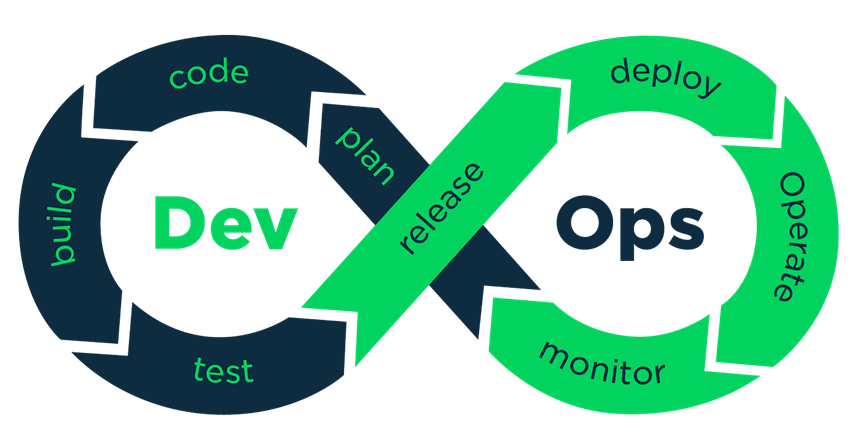

# Introduction

### SDLC (Software Development Life Cycle)

It is a methodology that defines the entire procedure of software development step-by-step. The goal of the SDLC model is to deliver high-quality, cost efficient and maintainable software that meets the user’s requirements.

SDLC outlines the software development into stages to peform the task efficiently.

### Stages in SDLC

### SDLC Models

**1\. Waterfall Model**

A linear sequential model best for small, well-defined projects with clear requirements.

**Phases:**

Requirement → Analysis → Design → Implementation → Testing → Deployment → Maintenance

| **Pros**                  | **Cons**                                      |
| ------------------------- | --------------------------------------------- |
| Simple and easy to manage | Rigid, no flexibility to accommodate changes. |
| Clearly defined stages.   | Late-stage testing increases risks.           |

**2\. V-Model (Validation and Verification Model)**

Development and testing go concurrently and verification and validation go hand in hand. Best for critical projects like testing is crucial.

**Structure:**

Each development phase has a corresponding testing phase (e.g., Requirements ↔ System Testing, Design ↔ Integration Testing).

| **Pros**                            | **Cons**                                      |
| ----------------------------------- | --------------------------------------------- |
| High-quality and systematic testing | Expensive and time-consuming                  |
| Bugs detected early                 | Not suitable for frequent requirement changes |

**3\. Prototype Model**

First a prototype is created and then the final product is manufactured based on that prototype.

**Approach:**

Prototypes were developed, tested by customer and based upon feedback refinements are done.

| **Pros**                                | **Cons**                                              |
| --------------------------------------- | ----------------------------------------------------- |
| Development cost and time reduced       | Requires frequent customer involvement                |
| Changes can be implemented to prototype | Alteration of requirment can hamper the final product |

**4\. Iterative Model**

The product is divided into managable pieces and best for projects where requirements evolve over time.

**Approach:**

Software is developed in small iterations, improving upon previous versions.

| **Pros**                          | **Cons**                                      |
| --------------------------------- | --------------------------------------------- |
| Early release of working software | Requires frequent customer involvement        |
| Less risk compared to Waterfall   | More resources needed for multiple iterations |

**5\. Spiral Model**

It's a mix of iterative and prototype approach best for: Large, high-risk projects requiring frequent evaluation.

**Structure:**

Planning → Risk Analysis → Engineering → Evaluation (repeats in a spiral manner).

| **Pros**                    | **Cons**                              |
| --------------------------- | ------------------------------------- |
| Strong risk management      | Expensive and complex                 |
| Allows changes at any stage | Requires highly skilled risk analysts |

**6\. Agile Model**

A combination of iterative and incremental models where large projects are break down into smaller, manageable iterations or sprints

**Structure:**

Divides the project into sprints (short development cycles).

Focuses on customer collaboration and continuous delivery.

**Popular Agile Frameworks:**

- Scrum (Sprints, Daily Standups, Backlogs)
- Kanban (Visual Workflow Management)

| **Pros**                   | **Cons**                            |
| -------------------------- | ----------------------------------- |
| Quick delivery of features | difficult to estimate time and cost |

**7\. Big Bang Model**

Model with not established process where the result is a developed software that may or may not be as per client requriements.

**Approach:**

No formal process: coding starts immediately.

| **Pros**           | **Cons**                                     |
| ------------------ | -------------------------------------------- |
| Quick and flexible | High risk of failure due to lack of planning |

### DevOps (Development + Operations)

Set of practicies, philosophies and tools that aims to automate and shorten the SDLC process at every stage, to deliver high quality softwares.

**Note:** Development follows agile method whereas the Operations follows the ITIL to provide stable environment

### Continuous Integration (CI)

A software development practice where developers frequently push their code changes into a shared repository, with each integration triggering automated builds and tests to ensure the codebase remains stable and bug-free.

### Continuous Delivery (CD)

It is an extension of continous integration ensuring code is always in a deployable state and can be reliably released at any time.
